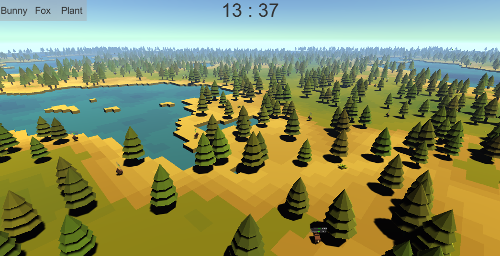

# Biomes 

This research project is based on [Sebastian Lague's simulation of ecosystems](https://www.youtube.com/watch?v=r_It_X7v-1E) using Unity.
My goal is to improve upon his original simulation by adding extra factors from real ecosystems, such as seasons and a variation of species. Besides that I aim to make this simulation easier to navigate and enjoy.

## Snapshots
### v0.1 - Added simulated day and night cycle, aging of all species, UI for visualization, and LWRP with post-processing.

